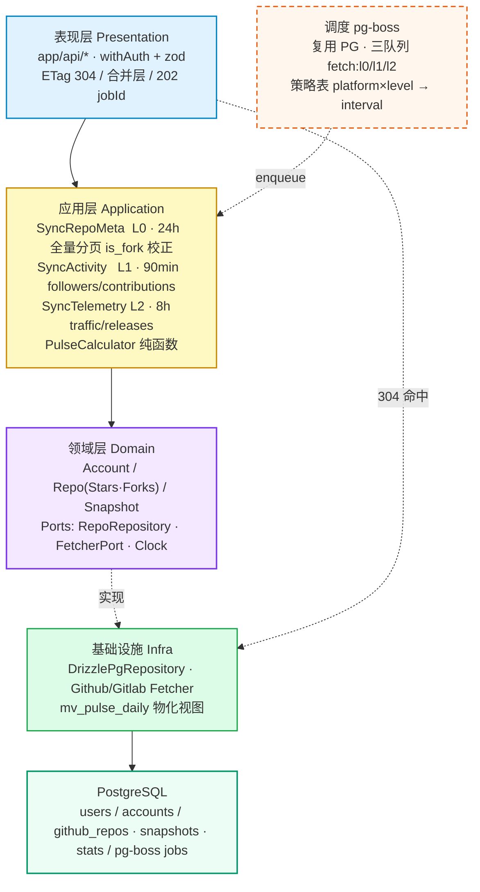

# Backend Re-Architecture Design — Dashboard

> **Branch:** `codex/backend-rearch` · **Date:** 2026-08-29 · **Scope:** 后端全量（前端冻结）· **Queue:** `pg-boss` 复用现有 PG

## 1. 背景与目标

当前后端为单进程 `React Router Node + Drizzle PG`，首请求 `auth-middleware` 内 `ensureBootstrap`，`fetcher` 边抓边写库，`pulse` 600 行裸 SQL 聚合，`is_fork` 漏更导致脉搏 80 vs 100+。目标：按 `L0 24h / L1 90min / L2 8h` 三档等级化调控 Fetch，建立可测试、可观测、零 `globalThis` 的整洁架构。

**成功标准：**
* `L0` 全量分页自愈 `is_fork`，`GET /api/pulse` 304 命中 <15ms，`pg-boss` 三队列深度可观测，`@ts-nocheck` 清零，非 Fork Star 总数与 GitHub Profile 一致。

## 2. 靶架构分层

```
Presentation (app/api/*, 薄)
  → Application (UseCases: SyncRepoMeta L0 / SyncActivity L1 / SyncTelemetry L2 + PulseCalculator)
    → Domain (Entities: Account/Repo/Snapshot, Ports: RepoRepository/FetcherPort/Clock)
      ← Infra (DrizzlePgRepository / Fetcher Adapters / PgBossScheduler / Config)
```

单向依赖，Domain 零依赖；`globalThis.__schedulerStarted/__dashboardConfig` 移除，`Config/Logger/Clock` 启动时注入。

**靶架构图（干净版）：**


## 3. 领域模型与端口

**Entities / ValueObjects (`lib/domain/`):**
- `Account {id, screenName, platform, ownerId, instanceUrl, fetchIntervalOverride?}`
- `Repo {accountId, repoId, name, fullName, stars: Stars, forks: Forks, isFork, language, topics}`
- `RepoSnapshot {repoId, stars, forks, snapshotDate}`
- `Stars/Forks` ValueObject（≥0，暴露 `delta()`）

**Ports (`lib/domain/ports.ts`):**
```ts
interface RepoRepository {
  findAllByAccountIds(ids: number[]): Promise<Repo[]>
  findSnapshotsBefore(ids: number[], sinceDay: string): Promise<Map<string, Snapshot>>
  findSnapshotsInWindow(ids: number[], sinceDay: string, untilDay: string): Promise<Map<string, Snapshot>>
  upsertRepos(repos: Repo[]): Promise<void>
  upsertSnapshots(s: Snapshot[]): Promise<void>
}
interface StatsRepository { findLatest(accountId: number): Promise<Stats> }
interface FetcherPort { fetchRepoMeta(account: Account): Promise<Repo[]>; fetchActivity(a: Account): Promise<Activity> }
interface Clock { now(): Date }
```

方法名即意图，隐藏 `DISTINCT ON` 等 PG 方言。

## 4. 应用层：三档 UseCase

- `SyncRepoMeta` (L0, 24h, 全量分页)：`Fetcher.fetchRepoMeta` → `RepoRepository.upsertRepos`（含 `is_fork/full_name/homepage`），写 `github_repo_snapshots` 日快照
- `SyncActivity` (L1, 90min)：`user_stats/contributions/followers`
- `SyncTelemetry` (L2, 8h)：`traffic/referrers/releases`，需 PAT，`403` 记 `capabilityGap` 降级
- 幂等键 `(accountId, level, YYYY-MM-DD)`，`pg-boss` 重试，`capabilityGaps` 落 `fetch_runs`

策略表 `fetch_policy(platform, level) → interval`，`account.fetch_interval` 仅作覆盖。

## 5. 基础设施

- `DrizzlePgRepository` 实现 `RepoRepository`，封装 `DISTINCT ON`，去 `@ts-nocheck`
- `GithubFetcher implements FetcherPort`：`GithubClient`（Bearer PAT, Link 分页, 30s Abort, withNetworkRetry）+ `GithubMapper`（fork→is_fork, stargazers→Stars）
- `PgBossScheduler`：三队列 `fetch:l0/l1/l2`，`completed/failed` 进 `fetch_runs`
- `Config/Logger/Clock` 在 `server/index.mjs` 启动时构造注入，无 `globalThis`

## 6. 表现层（薄）+ 前端优化

- `app/api/*` 仅 `zod` + `withAuth(ctx)`，`GET /api/pulse` 读物化视图 `mv_pulse_daily` → `PulseCalculator.build` → `ETag = hash(generatedAt+ids)` + `Cache-Control: public, max-age=60, stale-while-revalidate=180` → `304`
- 请求合并层：500ms 窗口内同类 `github/overview/:id` 合并为 `WHERE account_id = ANY(...)`
- 部分成功：`{error: null, gaps: []}`，`429` 带 `Retry-After`
- 分页：`GET /api/github/:id/repos?limit&cursor&fields=stars,forks`
- 异步：`POST /api/fetch/:id?level=l0` → `202 {jobId}` + `GET /api/fetch/:jobId` 轮询（后续可切 SSE）

## 7. 数据流

**请求轨（同步）：** `Query → GET /api/pulse (If-None-Match) → withAuth → PulseReadModel → Calculator → 304/200`

**抓取轨（异步）：** `pg-boss cron → enqueue{level} → Worker: Fetcher → Event → UseCase → Repository → REFRESH mv_pulse_daily CONCURRENTLY`

## 8. 错误与可观测性

- 统一信封 `{error:{code,message}, gaps: CapabilityGap[]}`，`fetch_runs(capability,status,message)` 替代 `accounts.error_message` 拼接
- `logger` 按 `level/capability/accountId` 结构化，`health` 暴露 `queueDepth(L0/L1/L2)+lastSuccessAt`

## 9. 测试与迁移

- `Domain/PulseCalculator` 复用 `tests/pulse.test.ts` 纯单测；`Application` 用 `MockRepository`；`Infra` 用 `testcontainers` PG
- 迁移：建 `pg-boss` + `fetch_policy` + `mv_pulse_daily`；双写 1 版；`L0` 全量分页自愈存量 `is_fork`；灰度切读视图 24h 后删旧裸 SQL

## 10. 目录与 non-goals

```
lib/domain/{account,repo,snapshot,pulse}.ts
lib/domain/ports.ts
lib/application/usecases/{SyncRepoMeta,SyncActivity,SyncTelemetry}.ts
lib/application/scheduler/PgBossScheduler.ts
lib/infra/drizzle/{PgRepoRepository,PgStatsRepository}.ts
lib/infra/fetchers/{GithubClient,GithubMapper,GithubFetcher}.ts
app/api/* (thin)
db/migrations/* (pg-boss + mv)
```

**Non-goals：** 前端不动；不引入 Redis；不改 `users/accounts` 鉴权模型。

## 附录：现状 Fetcher 剖析

`lib/fetchers/github.ts:fetchGithubAccount` 250 行边抓边写，`?per_page=100` 截断，`runningAccounts Set` 内存锁，`capabilityGaps` 拼字符串。本次拆为 `Client抓→Mapper转→UseCase写` 三段，L0/L1/L2 物理隔离。
